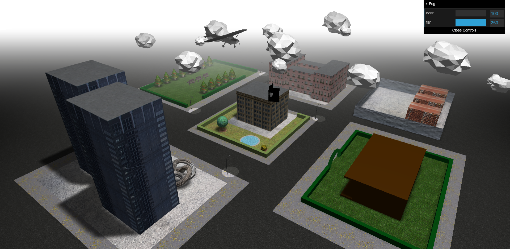

# Graphics-Animation Project
Project developed using Three.js and WebGL to create a graphic implementations of a town's section. 
Main features: 
- A setup for the environment of the app: a renderer, camera, camera controls & restrictions 
- A spotlight to mimic the sun (placed far away in the scene) and ambient light 
- Fog and a GUI to control the near and far parameters of the fog (using dat.GUI) 
- Geometries that make up the world including box geometries that create different types of buildings, hedges around some areas of the city and the 3 containers; planes to create different types of ground in different parts of the city (a general plane that makes up the roads and the rest of the environment; on top of this plane were added other segments to create different environments ), planes to create a fence around the 3 containers; a torus geometry to create an arch, a torus knot to create a statue; cylinder geometries to create the trunk of all trees; sphere geometries to create the crown of a tree and a flower bush; cone geometries to create the fir trees located in the park area. 
- Implemented the flag on top of the university building by creating a plane and then using an algorithm to create the wave animation (editUV function) 
-	Custom textures were applied on these geometries to give them a more realistic look and create depth within the scene 
- Repeating the texture on some geometries to avoid distortion using repeatWrapping 
- Some textures have bump maps to control how the lights hits the objects and give the scene a more realistic look (containers, asphalt plane, torus knot) 
- The fir cones that make up the trees in the park use a special algorithm when applying the Christmas texture in order to prevent distortion of the texture and preserve the pixel ration on both top and bottom of the cone 
-	Implementation of different 3D objects using an object loader 
-	Use of cloning to create the same object more than 1 time (pink buildings, skyscrapers, benches, light streets, clouds) 
- Use of a for loop that facilitates the placing of the fir tree cones and trucks in order to make the code clear, short and efficient  
-	Function to resize the scene appropriately when resizing the browser 
-	Every street light has an appropriate spot light created to give the illusion of a light bulb being lit 
-	Use of scene graph and grouping to make working with multiple elements syntactically clearer 
-	Optional helper functions that are commented out to help visualize the positioning of the street light’s spotlight and to visualize the main spotlight that casts shadows 
 

